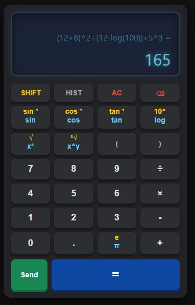
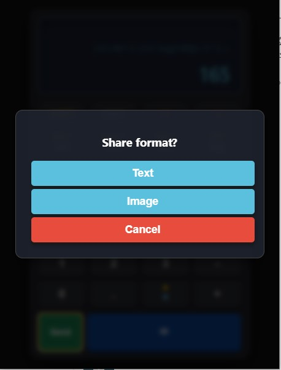
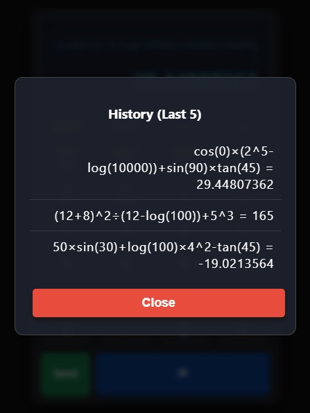

## 🛠️ Technologies Used
- **HTML5:** For the structure of the calculator.
- **CSS3:** For styling, responsive design, and animations.
- **Vanilla JavaScript (ES6+):** Core mathematical logic and DOM manipulation (No external libraries used).
- **WebXDC API:** For compatibility and sharing within the Delta Chat ecosystem.
## 📸 Screenshots

  
  
  

## 📦 How to Build and Use (WebXDC)
To use this calculator inside Delta Chat, you need to package it as a `.xdc` file:

1. Clone or download this repository to your local machine.
2. Select all the core files (`index.html`, `script.js`, `style.css` (if separated), and `icon.png` or `icon.jpg`). 
   > **Note:** Make sure you select the files directly, not the folder containing them.
3. Create a `.zip` archive of the selected files.
4. Rename the file extension from `.zip` to `.xdc` (for example: `calculator.xdc`).
5. Drag and drop the `.xdc` file into any Delta Chat chat. It's ready to use!

## 🤝 Contributing
Contributions, issues, and feature requests are always welcome! 
Feel free to check the [Issues page](https://github.com/MesterMiM/Delta-Scientific-Calculator/issues) if you want to contribute to the UI design, add more mathematical functions, or improve the code.

## 📝 License
This project is open-source and available under the [MIT License](LICENSE).

## 👨‍💻 Author
**Mester Thirteen (Mr. 13)**
- GitHub: [@MesterMiM](https://github.com/MesterMiM)
- Ecosystem: Delta Chat (WebXDC) Developer
